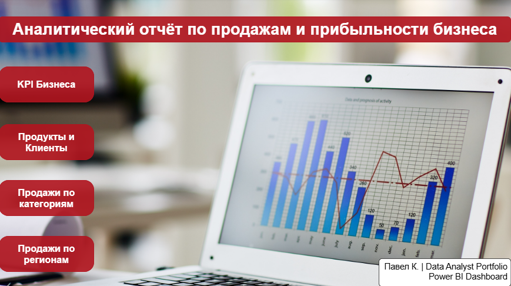
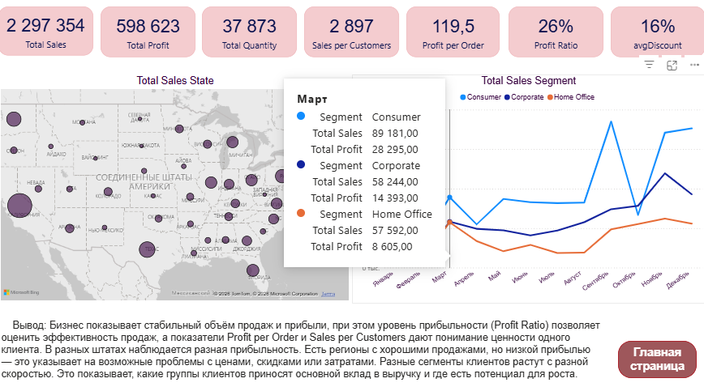
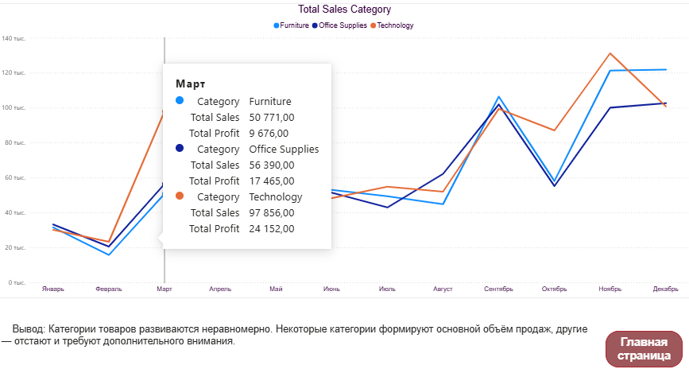
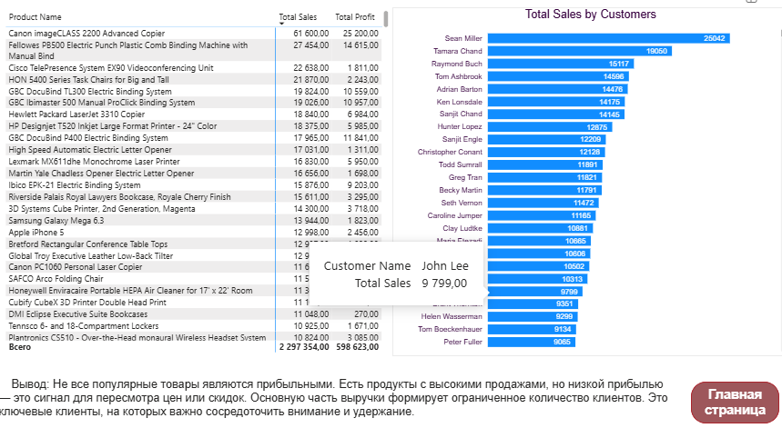
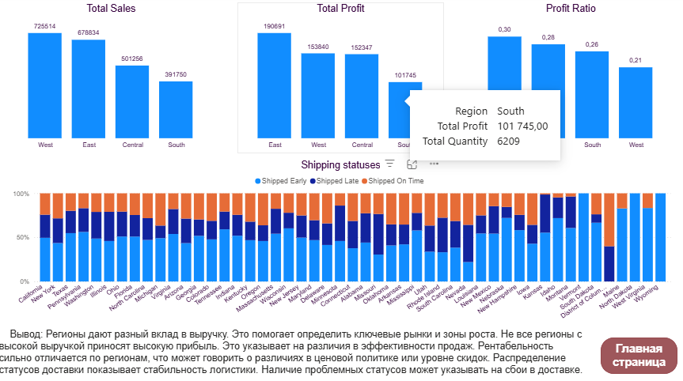

# 📊 Sales & Profitability Analysis (Power BI)

## 🎯 Project Overview
Interactive Power BI dashboard analyzing sales performance, 
profitability, customer behavior, and logistics across 
regions and product categories.

**Key Metrics:**
| Total Sales | Total Profit | Profit Ratio | Total Orders |
|-------------|--------------|--------------|--------------|
| $2,297,354  | $598,623     | 26%          | 37,873       |

---

## 💻 Key Features & Insights

### 1. Executive Summary (Navigation)
A central hub with navigation buttons for quick access 
to specific metrics: Business KPIs, Products/Customers, 
Categories, and Regions.

### 2. Business KPI & Regional Growth
- **Key Finding:** Stable sales volume, but profitability 
  varies significantly by state.
- **Insight:** West leads in Total Sales ($725K) but East 
  leads in Profit Ratio (30%) — signals pricing 
  inefficiency in the West region.
- **Action:** Review discount policies in low-profit states.

### 3. Category & Product Intelligence
- **Finding:** High-sales products aren't always 
  high-profit — signals need for margin review.
- **Customer Insight:** Top 20% of customers generate 
  the majority of revenue. These are key clients requiring 
  focused retention strategy.
- **Action:** Focus on retaining high-value customers 
  and re-evaluating low-margin products.

### 4. Logistics & Delivery Performance
- **Focus:** Profitability vs. delivery efficiency 
  by region.
- **Insight:** Shipping delays in certain states directly 
  impact overall profitability and customer satisfaction.
- **Action:** Identify bottleneck states and optimize 
  delivery processes.

---

## 🖼 Dashboard Preview

### Main Page

### KPIs and Regional Analysis

### Sales by Category

### Products and Customers

### Regional Sales and Delivery

---

## 🛠 Tools Used
- **Power BI Desktop** — DAX measures, Power Query, 
  Data Modeling
- **Data Model** — Star Schema (Fact and Dimension tables)
- **Data Transformation** — Power Query Editor

---

## 🎓 Skills Demonstrated
`Power BI` `DAX` `Power Query` `Data Modeling` 
`Star Schema` `KPI Design` `Business Intelligence` 
`Customer Segmentation` `Regional Analysis` 
`Data Visualization`

---

## 📂 Project Files
- **[Sales_Analytics.pbix](Sales_Analytics.pbix)** — 
  Download and open in Power BI Desktop to explore 
  the full interactive report.

---

## 👤 Author
**Pavel Kurkchiyan** — Data Analyst  
[LinkedIn](https://www.linkedin.com/in/pavel-kurkchiyan-8a5107365)
